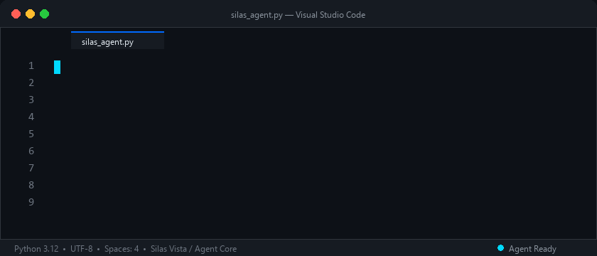

  

  

  
  
  

---

## 🚀 About Me

**Silas Vista** · **AI Engineer**  
Focused on **AI / Agents / RAG**.

- 🔭 Building **agentic systems** and **RAG pipelines**
- 🌱 Exploring **tool use, memory, and orchestration**
- 💬 Ask me about **LLM agents, RAG, or AI workflows**
- ⚡ Passionate about turning complex AI concepts into reliable, production-grade applications

---

## 📦 Products

### ⭐ [Windup](https://github.com/1024XEngineer/Windup)
> **AI Production Platform for 2D Game Assets.**  
> Turn ideas into production-ready game art and animated assets seamlessly.

---

### 🔮 [Verso](https://github.com/xiaocheny214/verso) `(WIP / Currently Building)`
> **Matches complementary people, not like-minded ones.**  
> Pair two minds from different domains to learn what they don't know from each other.

---

### 🌐 [UniGate](https://unigate.top)
> **One Gate, Infinite Possibilities.**  
> A high-performance aggregation and routing gateway.

---

## 🛠️ Tech Arsenal

### AI & Agent Engineering

  
  
  
  
  

### Backend Technologies

  
  

### Gateway & Infrastructure

  

### Development & AI-Assisted Tools

  

  
  
  

---

## 📊 GitHub Analytics

  
  

  

---

## 📬 Connect With Me

  

  <em>"Ship, learn, iterate."</em>

